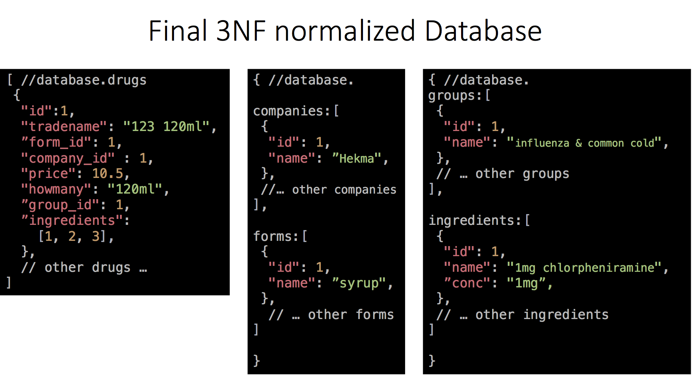
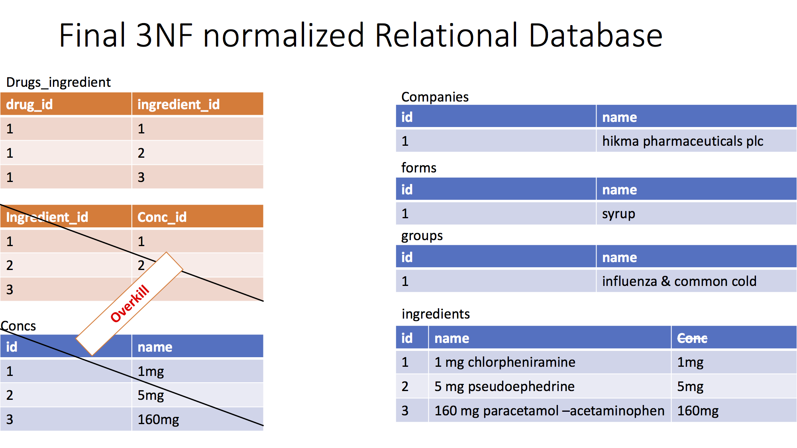
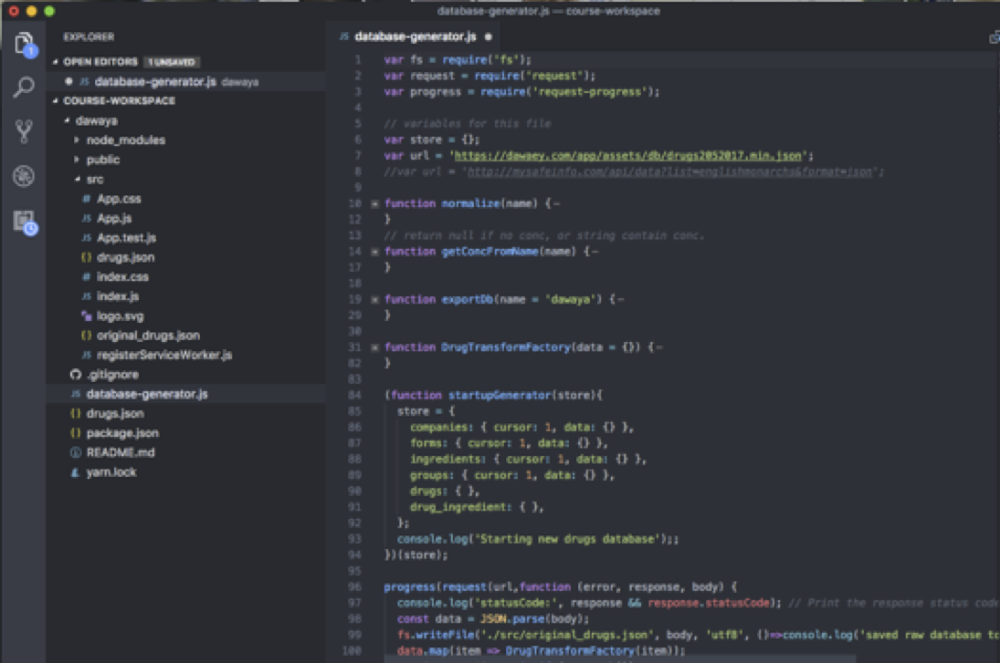

## Dawaya Data Structure {#dawaya-data-structure}

Database powering this app is located @https://dawaey.com/app/assets/db/drugs2052017.min.json, you can view this using Devtools network Tab.

First step to improve current database is by following simple normalization rules

*   Make sure that all attributes of object has correct data type
*   Make sure that any data that is repeated in more than one drug are moved to its own table, and replaced by reference id (remove redundancy)
*   Run onetime transformation Code to create new data structure, and save it to your project folder.

This is Called “**Database Normalization**”:

*   is the process of organizing the columns (attributes) and tables (relations) of a relational **database** to **reduce data redundancy and improve data integrity**.

if you need to learn more about normalization google the concept, here are few keywords

*   Normalized Vs Deformalized database, 3N normalization, Relational Database design, NoSQL relations

### First Step, Check datatypes of Drug object {#first-step-check-datatypes-of-drug-object}

1.  Activeingredient contain a list datatype, spited by \n, so let’s fix that by using js .split(‘\n’) function.
2.  Good now look at list, each Ingredient entry contain 2 information, ingredient name and concentration (1mg, 15mg etc.) so let’s fix that also
3.  Now we need to apply rule 2, and remove redundant Data
    - Redundant data are data that can exists in More than 1 drug, “like company:Hikma” is string, this
    - Should be moved to its own companies object and Replaced with Company_id

Now Lets Pause and think of our database choices.

Our Drug Object shape will now look like:-
```javascript
{
id: 1,
tradename: &quot;123 120ml&quot;,
price: 10.5,

company_id: 1, _//ref companies[1]_
form_id: 1, _//ref forms[1]_
size_id: 1, _//ref sizes[1]_
group_id: 1 _//ref groups[1]_
ingredients: [ 1, 2, 3 ] _//ref companies[1] &amp; [2] &amp; [2]_
}
```
and now we should have 6 objects that hold data,

drugs, companies, forms, sizes, groups, ingredients.

### Big question Is Normalization worth it ? {#big-question-is-normalization-worth-it}

The answer is yes 100%, every time and in most situations. Normalization will beat denormalized database every day and twice on Monday’s as they say !.

This is about Accumulative Generations of Experience That they all agreed on normalization, and no fronend revolution will come and destroy database enginers temple now ! I’m raciest about this, but will proof this point of view to be very valid when it comes to server implementation. You will see how easy it is to handle data when its correctly structured.

But Above all Database Normalization Solve main problems like.

1.  Data integrity
2.  Data Redundancy
3.  Allow You To think of your database Models as Distinct Objects, Each object has its own Type, Attributes, enable type checking, and all goodies of OOP.
4.  Maintenance wise, if I want to for example change “syrup” form to “liquid syrup” now I can do it in one place in 5 secounds, otherwise I would have to do search-replace hacks to change its 693 occurrences in our old denormalized JSON we got from dawaya.
5.  Now if we need to add localization for example ! we can add ar_name attribute to each object and that it. No hacking involved.

### Final Database structure {#final-database-structure}

| | |
|-|-|


### Transform Dawaya Database to Our new format {#transform-dawaya-database-to-our-new-format}

Todo this we can use Node.js to write our first automation tool.. let’s call it “database-generator.js” this file will be responsible for fetching Dawaya database, apply transformation of all drugs, and save our new drugs database into static drugs.json file inside our project

Go back to your vscode and create new file at root of dawaya folder, call it database-generator.js Copy past content from this course Chapter 5 exercise files, here’s a quick snapshot

We first define a store variable that will hold our new database data, then fetch database from remote, loop over each drug and call DrugTransformFactory(item) to transform item to new shape. Finally we use node-fs library “fs short for file-system’ to write new database to ./src/drugs.json and also keep a copy of remote database as is in ./original_drugs.json.


Now every time we want to recreate our database from remote origin, we only need to run

```bash
node ./database-generator.js
```

And this command will do all work and give us a new drugs.json up to our standards.
