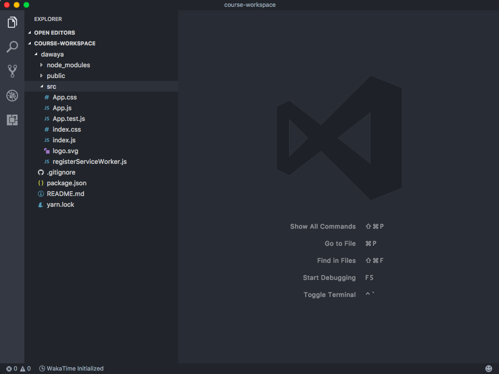

## Setup Project {#setup-project}

### First Command-line usage {#first-command-line-usage}

Open command line, and navigate your course folder that your did setup in [Chapter 2 terminal setup ](chapter_2/terminal_command_line.md))

```bash
cd course-workspace
cd course-workspace
create-react-app dawaya
code .
cd dawaya
```

in above, we moved inside course-workspace folder, which we are useing to save all this course work from now on, 

`cd dawaya` will let us navigate inside reactjs folder folder, then created our first reactjs Application using create-react-app tool which we installed earlier in Chapter 2, then we launch vscode in root folder with “code .” command.



This is How it looks like,

| folder | function|
|---|---|
|node_modules|this is where npm will be saving all the packages you installed, and its dependencies including react it self !|
|public|this contain the index.html, you can edit it if you need to, thats the source of your end product|
|src| this is where you will be working while developing a react application !, it include all source file of your app|

inside src app, **create-react-app** will put some default placeholder files, we will delete all of them later but for now, just go back to terminal and run

```bash
yarn start
````

this will run your react app and open a browser. now back to terminal and close running server by `Control+C` then run

```bash
yarn build
````

this code will tell **create-react-app** to take your source code inside /src folder, and uglify it, and include all other libraries that you used in any of your app files

**Important TIP:** for example if you used npm to install a library that is 200kb size and contain 100 function inside it, yet you only used 1 function of the 100, **create-react-app** and webpack are smart enought to only include this 1 function and ignore the other 99 functions in this library in your production vendor.js file:D ! this mean that your end build.js file will not include the whole 200kb file but will only include the bits of code that you used. this term is called **Tree Shaking** and it happen for you for free !, so don't be afraid to npm install any library, after all if you dont use it in your code it will not be included in the build file :) Cheers.


Now To Recommendations


### Basic recommended libraries for any reactjs Project {#basic-recommended-libraries-for-any-reactjs-project}

*   **prop-types** “library used during react development, it was part of react but moved out to its own lib”
*   **Immutable.js**
*   **React-proptypes**
*   **Redux**
*   **React-router**
*   A **reset.css** library
    *   reset/normalize css are styles that remove cross browser differences in look of html
*   A **react u.i. library** of your choice “react-toolbox, material-ui, react-bootstrap”
*   **a css library** “bootstrap, Materialize css, Foundation, mdl” or any other of your choice !
*   For ajax server communication I use &quot;**apisauce**” which is based on excellent axios lib.
*   **Icons library** [&quot;font-awesome”, material-design-icons-iconfont, ionicons, or all of them !]
*   **Airbnb-eslint-styles** or any eslint config you prefers.

### Special case libraries I yet prefer to include them all in initial setup {#special-case-libraries-i-yet-prefer-to-include-them-all-in-initial-setup}

*   Select :- Create advanced memorized selectors for your data –more about that later
*   Moment.js :- make manipulating Dates in js very easy and fun moment.add(1,’day’).subtract(‘1’,’month’).toCalendar() //hurray!
*   Lodash :- a collection of super-fast JavaScript helpers “slice and array, filter objects etc..”